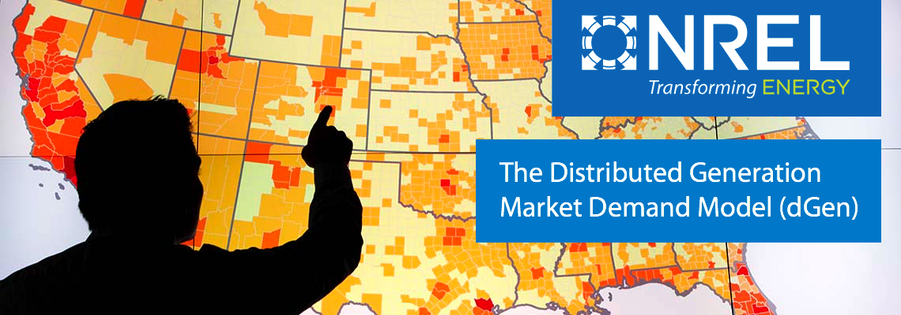

.. dGen Mexico documentation master file, created by
   sphinx-quickstart on Mon Feb 25 14:35:41 2019.
   You can adapt this file completely to your liking, but it should at least
   contain the root `toctree` directive.

Welcome to dGen Mexico's documentation!
=======================================

The Distributed Generation Market Demand (dGen) model simulates customer adoption of distributed energy resources (DERs) for residential, commercial, and industrial entities in the United States or other countries through 2050. dGen was written by the The National Renewable Energy Laboratory (NREL). 

The dGen model can help develop DER deployment forecasts for a range of spatial and temporal scales. To learn more, see `model applications <https://www.nrel.gov/analysis/dgen/model-applications.html>`_.

This version of the model is specifically set-up for the Mexican context. This includes the usage of Mexican states and control areas along with Mexican demographic and load data. 

Use Cases
---------

- Identifying the sectors, locations, and customers for whom adopting DERs would have a high economic value

- Generating forecasts as an input to estimate distribution hosting capacity analysis, integrated resource planning, and load forecasting

- Understanding the economic or policy conditions in which DER adoption becomes viable
- Illustrating sensitivity to market and policy changes such as retail electricity rate structures, net energy metering, and technology costs.

An open-source version of the dGen model is currently being developed as part of the Resilient Planning for Distributed Energy Resources project. Learn about the `open-source version's development <https://www.nrel.gov/analysis/dgen/open-source-development.html>`_.

Modeling Process
-----------------

Consumer demand is modeled through an agent-based approach that includes five steps:

1. Generating agents (i.e., potential customers) and assigning them attributes based on a
   probabilistic representation of individual customer types.
2. Applying technical and siting restrictions, such as resource quality, rooftop availability
   (solar), and quality for each agent.
3. Performing economic calculations using cash flow analysis incorporating project costs,
   prevailing retail rates, incentives, and net metering considerations.
4. Calculating market share of each technology by simulating technology adoption based on
   Bass-style adoption and other considerations of consumer behavior.
5. Determining the total installed capacity by agent and jurisdiction for each year. 

Documentation Table of Contents
-------------------------------
.. toctree::
   :maxdepth: 2

   source/tutorial
   source/examples
   source/installation
   source/api
   source/input_data
